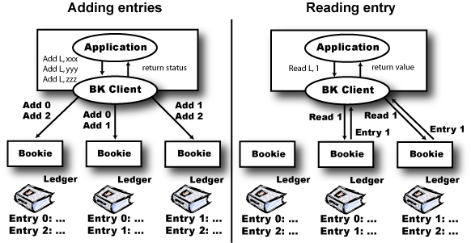

<!--
Copyright 2002-2004 The Apache Software Foundation

Licensed under the Apache License, Version 2.0 (the "License");
you may not use this file except in compliance with the License.
You may obtain a copy of the License at

http://www.apache.org/licenses/LICENSE-2.0

Unless required by applicable law or agreed to in writing, software
distributed under the License is distributed on an "AS IS" BASIS,
WITHOUT WARRANTIES OR CONDITIONS OF ANY KIND, either express or implied.
See the License for the specific language governing permissions and
limitations under the License.
//-->

# BookKeeper overview

* [BookKeeper overview](#bk_Overview)
    * [BookKeeper introduction](#bk_Intro)
    * [In slightly more detail...](#bk_moreDetail)
    * [Bookkeeper elements and concept](#bk_basicComponents)
    * [Bookkeeper initial design](#bk_initialDesign)
    * [Bookkeeper metadata management](#bk_metadata)
    * [Closing out ledgers](#bk_closingOut)
  

## BookKeeper overview

### BookKeeper introduction
BookKeeper is a replicated service to reliably log streams of records. In BookKeeper, 
servers are "bookies", log streams are "ledgers", and each unit of a log (aka record) is a 
"ledger entry". BookKeeper is designed to be reliable; bookies, the servers that store 
ledgers, can crash, corrupt data, discard data, but as long as there are enough bookies 
behaving correctly the service as a whole behaves correctly.

The initial motivation for BookKeeper comes from the namenode of HDFS. Namenodes have to 
log operations in a reliable fashion so that recovery is possible in the case of crashes. 
We have found the applications for BookKeeper extend far beyond HDFS, however. Essentially, 
any application that requires an append storage can replace their implementations with
BookKeeper. BookKeeper has the advantage of scaling throughput with the number of servers. 

At a high level, a bookkeeper client receives entries from a client application and stores it to
sets of bookies, and there are a few advantages in having such a service:

* We can use hardware that is optimized for such a service. We currently believe that such a system has to be optimized only for disk I/O;
* We can have a pool of servers implementing such a log system, and shared among a number of servers;
* We can have a higher degree of replication with such a pool, which makes sense if the hardware necessary for it is cheaper compared to the one the application uses. 

### In slightly more detail...
BookKeeper implements highly available logs, and it has been designed with write-ahead logging in mind. Besides high availability
due to the replicated nature of the service, it provides high throughput due to striping. As we write entries in a subset of bookies of an
ensemble and rotate writes across available quorums, we are able to increase throughput with the number of servers for both reads and writes. 
Scalability is a property that is possible to achieve in this case due to the use of quorums. Other replication techniques, such as 
state-machine replication, do not enable such a property. 

An application first creates a ledger before writing to bookies through a local BookKeeper client instance.   
Upon creating a ledger, a BookKeeper client writes metadata about the ledger to ZooKeeper. Each ledger currently 
has a single writer. This writer has to execute a close ledger operation before any other client can read from it. 
If the writer of a ledger does not close a ledger properly because, for example, it has crashed before having the 
opportunity of closing the ledger, then the next client that tries to open a ledger executes a procedure to recover
it. As closing a ledger consists essentially of writing the last entry written to a ledger to ZooKeeper, the recovery
procedure simply finds the last entry written correctly and writes it to ZooKeeper.

Note that currently this recovery procedure is executed automatically upon trying to open a ledger and no explicit action is necessary. 
Although two clients may try to recover a ledger concurrently, only one will succeed, the first one that is able to create the close znode
for the ledger.

### Bookkeeper elements and concepts 
BookKeeper uses four basic elements:

* **Ledger**: A ledger is a sequence of entries, and each entry is a sequence of bytes. Entries are
written sequentially to a ledger and at most once. Consequently, ledgers have an append-only semantics;
* **BookKeeper client**: A client runs along with a BookKeeper application, and it enables applications
to execute operations on ledgers, such as creating a ledger and writing to it; 
* **Bookie**: A bookie is a BookKeeper storage server. Bookies store the content of ledgers. For any given
ledger L, we call an <em>ensemble</em> the group of bookies storing the content of L. For performance, we store on
each bookie of an ensemble only a fragment of a ledger. That is, we stripe when writing entries to a ledger such that
each entry is written to sub-group of bookies of the ensemble.
* **Metadata storage service**: BookKeeper requires a metadata storage service to store information related 
to ledgers and available bookies. We currently use ZooKeeper for such a task.     

### Bookkeeper initial design
A set of bookies implements BookKeeper, and we use a quorum-based protocol to replicate data across the bookies. 
There are basically two operations to an existing ledger: read and append. Here is the complete API list 
(mode detail [here](bookkeeperProgrammer.html)):

* Create ledger: creates a new empty ledger;
* Open ledger: opens an existing ledger for reading;
* Add entry: adds a record to a ledger either synchronously or asynchronously;
* Read entries: reads a sequence of entries from a ledger either synchronously or asynchronously

There is only a single client that can write to a ledger. Once that ledger is closed or the client fails, 
no more entries can be added. (We take advantage of this behavior to provide our strong guarantees.) 
There will not be gaps in the ledger. Fingers get broken, people get roughed up or end up in prison when
books are manipulated, so there is no deleting or changing of entries.

A simple use of BooKeeper is to implement a write-ahead transaction log. A server maintains an in-memory data structure
(with periodic snapshots for example) and logs changes to that structure before it applies the change. The application 
server creates a ledger at startup and store the ledger id and password in a well known place (ZooKeeper maybe). When 
it needs to make a change, the server adds an entry with the change information to a ledger and apply the change when 
BookKeeper adds the entry successfully. The server can even use asyncAddEntry to queue up many changes for high change
throughput. BooKeeper meticulously logs the changes in order and call the completion functions in order.

When the application server dies, a backup server will come online, get the last snapshot and then it will open the 
ledger of the old server and read all the entries from the time the snapshot was taken. (Since it doesn't know the 
last entry number it will use MAX_INTEGER). Once all the entries have been processed, it will close the ledger and 
start a new one for its use. 

A client library takes care of communicating with bookies and managing entry numbers. An entry has the following fields:

##### Entry fields
| Field         | Type | Description                        |
|---------------|------|------------------------------------|
| Ledger number | long | The id of the ledger of this entry |
| Entry number  | long | The id of this entry |
| last confirmed (<em>LC</em>) | long | id of the last recorded entry |
| data | byte[] | the entry data (supplied by application) |
| authentication code | byte[] | Message authentication code that includes all other fields of the entry |

The client library generates a ledger entry. None of the fields are modified by the bookies and only the first three 
fields are interpreted by the bookies.

To add to a ledger, the client generates the entry above using the ledger number. The entry number will be one more 
than the last entry generated. The <em>LC</em> field contains the last entry that has been successfully recorded by BookKeeper. 
If the client writes entries one at a time, <em>LC</em> is the last entry id. But, if the client is using asyncAddEntry, there 
may be many entries in flight. An entry is considered recorded when both of the following conditions are met:

* the entry has been accepted by a quorum of bookies
* all entries with a lower entry id have been accepted by a quorum of bookies

<em>LC</em> seems mysterious right now, but it is too early to explain how we use it; just smile and move on.

Once all the other fields have been field in, the client generates an authentication code with all of the previous fields. 
The entry is then sent to a quorum of bookies to be recorded. Any failures will result in the entry being sent to a new
quorum of bookies.

To read, the client library initially contacts a bookie and starts requesting entries. If an entry is missing or 
invalid (a bad MAC for example), the client will make a request to a different bookie. By using quorum writes, 
as long as enough bookies are up we are guaranteed to eventually be able to read an entry.

### Bookkeeper metadata management
There are some meta data that needs to be made available to BookKeeper clients:

* The available bookies;
* The list of ledgers;
* The list of bookies that have been used for a given ledger;
* The last entry of a ledger; 

We maintain this information in ZooKeeper. Bookies use ephemeral nodes to indicate their availability. Clients 
use znodes to track ledger creation and deletion and also to know the end of the ledger and the bookies that 
were used to store the ledger. Bookies also watch the ledger list so that they can cleanup ledgers that get deleted.

### Closing out ledgers
The process of closing out the ledger and finding the last ledger is difficult due to the durability guarantees of BookKeeper:
* If an entry has been successfully recorded, it must be readable.
* If an entry is read once, it must always be available to be read. 

If the ledger was closed gracefully, ZooKeeper will have the last entry and everything will work well. But, if the 
BookKeeper client that was writing the ledger dies, there is some recovery that needs to take place.

The problematic entries are the ones at the end of the ledger. There can be entries in flight when a BookKeeper client 
dies. If the entry only gets to one bookie, the entry should not be readable since the entry will disappear if that bookie
fails. If the entry is only on one bookie, that doesn't mean that the entry has not been recorded successfully; the other
bookies that recorded the entry might have failed.

The trick to making everything work is to have a correct idea of a last entry. We do it in roughly three steps:

* Find the entry with the highest last recorded entry, <em>LC</em>;
* Find the highest consecutively recorded entry, <em>LR</em>;
* Make sure that all entries between <em>LC</em> and <em>LR</em> are on a quorum of bookies; 
