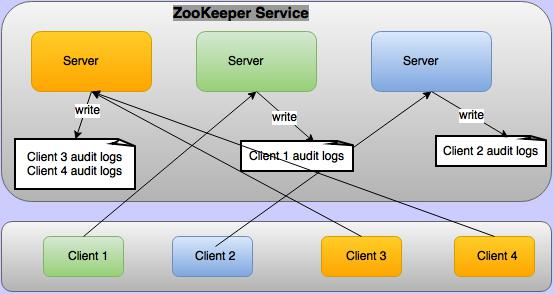

<!--
Copyright 2002-2004 The Apache Software Foundation

Licensed under the Apache License, Version 2.0 (the "License");
you may not use this file except in compliance with the License.
You may obtain a copy of the License at

http://www.apache.org/licenses/LICENSE-2.0

Unless required by applicable law or agreed to in writing, software
distributed under the License is distributed on an "AS IS" BASIS,
WITHOUT WARRANTIES OR CONDITIONS OF ANY KIND, either express or implied.
See the License for the specific language governing permissions and
limitations under the License.
//-->

# ZooKeeper Audit Logging

* [ZooKeeper Audit Logs](#ch_auditLogs)
* [ZooKeeper Audit Log Configuration](#ch_reconfig_format)
* [Who is taken as user in audit logs?](#ch_zkAuditUser)

## ZooKeeper Audit Logs

Apache ZooKeeper supports audit logs from version 3.6.0. By default audit logs are disabled. To enable audit logs
 configure audit.enable=true in conf/zoo.cfg. Audit logs are not logged on all the ZooKeeper servers, but logged only on the servers where client is connected as depicted in below figure.

The audit log captures detailed information for the operations that are selected to be audited. The audit information is written as a set of key=value pairs for the following keys

| Key   | Value |
| ----- | ----- |
|session | client session id |
|user | comma separated list of users who are associate with a client session. For more on this, see [Who is taken as user in audit logs](#ch_zkAuditUser).
|ip | client IP address
|operation | any one of the selected operations for audit. Possible values are(serverStart, serverStop, create, delete, setData, setAcl, multiOperation, reconfig, ephemeralZNodeDeleteOnSessionClose)
|znode | path of the znode
|znode type | type of znode in case of creation operation
|acl | String representation of znode ACL like cdrwa(create, delete,read, write, admin). This is logged only for setAcl operation
|result | result of the operation. Possible values are (success/failure/invoked). Result "invoked" is used for serverStop operation because stop is logged before ensuring that server actually stopped.

Below are sample audit logs for all operations, where client is connected from 192.168.1.2, client principal is zkcli@HADOOP.COM, server principal is zookeeper/192.168.1.3@HADOOP.COM

    user=zookeeper/192.168.1.3 operation=serverStart   result=success
    session=0x19344730000   user=192.168.1.2,zkcli@HADOOP.COM  ip=192.168.1.2    operation=create    znode=/a    znode_type=persistent  result=success
    session=0x19344730000   user=192.168.1.2,zkcli@HADOOP.COM  ip=192.168.1.2    operation=create    znode=/a    znode_type=persistent  result=failure
    session=0x19344730000   user=192.168.1.2,zkcli@HADOOP.COM  ip=192.168.1.2    operation=setData   znode=/a    result=failure
    session=0x19344730000   user=192.168.1.2,zkcli@HADOOP.COM  ip=192.168.1.2    operation=setData   znode=/a    result=success
    session=0x19344730000   user=192.168.1.2,zkcli@HADOOP.COM  ip=192.168.1.2    operation=setAcl    znode=/a    acl=world:anyone:cdrwa  result=failure
    session=0x19344730000   user=192.168.1.2,zkcli@HADOOP.COM  ip=192.168.1.2    operation=setAcl    znode=/a    acl=world:anyone:cdrwa  result=success
    session=0x19344730000   user=192.168.1.2,zkcli@HADOOP.COM  ip=192.168.1.2    operation=create    znode=/b    znode_type=persistent  result=success
    session=0x19344730000   user=192.168.1.2,zkcli@HADOOP.COM  ip=192.168.1.2    operation=setData   znode=/b    result=success
    session=0x19344730000   user=192.168.1.2,zkcli@HADOOP.COM  ip=192.168.1.2    operation=delete    znode=/b    result=success
    session=0x19344730000   user=192.168.1.2,zkcli@HADOOP.COM  ip=192.168.1.2    operation=multiOperation    result=failure
    session=0x19344730000   user=192.168.1.2,zkcli@HADOOP.COM  ip=192.168.1.2    operation=delete    znode=/a    result=failure
    session=0x19344730000   user=192.168.1.2,zkcli@HADOOP.COM  ip=192.168.1.2    operation=delete    znode=/a    result=success
    session=0x19344730001   user=192.168.1.2,zkcli@HADOOP.COM  ip=192.168.1.2    operation=create   znode=/ephemral znode_type=ephemral result=success
    session=0x19344730001   user=zookeeper/192.168.1.3   operation=ephemeralZNodeDeletionOnSessionCloseOrExpire  znode=/ephemral result=success
    session=0x19344730000   user=192.168.1.2,zkcli@HADOOP.COM  ip=192.168.1.2    operation=reconfig  znode=/zookeeper/config result=success
    user=zookeeper/192.168.1.3 operation=serverStop    result=invoked

## ZooKeeper Audit Log Configuration

By default audit logs are disabled. To enable audit logs configure audit.enable=true in conf/zoo.cfg. Audit logging is done using log4j. Following is the default log4j configuration for audit logs in conf/log4j.properties

    #
    # zk audit logging
    #
    zookeeper.auditlog.file=zookeeper_audit.log
    zookeeper.auditlog.threshold=INFO
    audit.logger=INFO, RFAAUDIT
    log4j.logger.org.apache.zookeeper.audit.Log4jAuditLogger=${audit.logger}
    log4j.additivity.org.apache.zookeeper.audit.Log4jAuditLogger=false
    log4j.appender.RFAAUDIT=org.apache.log4j.RollingFileAppender
    log4j.appender.RFAAUDIT.File=${zookeeper.log.dir}/${zookeeper.auditlog.file}
    log4j.appender.RFAAUDIT.layout=org.apache.log4j.PatternLayout
    log4j.appender.RFAAUDIT.layout.ConversionPattern=%d{ISO8601} %p %c{2}: %m%n
    log4j.appender.RFAAUDIT.Threshold=${zookeeper.auditlog.threshold}
    
    # Max log file size of 10MB
    log4j.appender.RFAAUDIT.MaxFileSize=10MB
    log4j.appender.RFAAUDIT.MaxBackupIndex=10

Change above configuration to customize the auditlog file, number of backups, max file size, custom audit logger etc.

## Who is taken as user in audit logs?

By default there are only four authentication provider:

* IPAuthenticationProvider
* SASLAuthenticationProvider
* X509AuthenticationProvider
* DigestAuthenticationProvider

User is decided based on the configured authentication provider:

* When IPAuthenticationProvider is configured then authenticated IP is taken as user
* When SASLAuthenticationProvider is configured then client principal is taken as user
* When X509AuthenticationProvider is configured then client certificate is taken as user
* When DigestAuthenticationProvider is configured then authenticated user is user 

Custom authentication provider can override org.apache.zookeeper.server.auth.AuthenticationProvider.getUserName(String id)
 to provide user name. If authentication provider is not overriding this method then whatever is stored in 
 org.apache.zookeeper.data.Id.id is taken as user. 
 Generally only user name is stored in this field but it is up to the custom authentication provider what they store in it. 
 For audit logging value of org.apache.zookeeper.data.Id.id would be taken as user.

In ZooKeeper Server not all the operations are done by clients but some operations are done by the server itself. For example when client closes the session, ephemeral znodes are deleted by the Server. These deletion are not done by clients directly but it is done the server itself these are called system operations. For these system operations the user associated with the ZooKeeper server are taken as user while audit logging these operations. For example if in ZooKeeper server principal is zookeeper/hadoop.hadoop.com@HADOOP.COM then this becomes the system user and all the system operations will be logged with this user name.

	user=zookeeper/hadoop.hadoop.com@HADOOP.COM operation=serverStart result=success

If there is no user associate with ZooKeeper server then the user who started the ZooKeeper server is taken as the user. For example if server started by root then root is taken as the system user

	user=root operation=serverStart result=success

Single client can attach multiple authentication schemes to a session, in this case all authenticated schemes will taken taken as user and will be presented as comma separated list. For example if a client is authenticate with principal zkcli@HADOOP.COM and ip 127.0.0.1 then create znode audit log will be as:		

	session=0x10c0bcb0000 user=zkcli@HADOOP.COM,127.0.0.1 ip=127.0.0.1 operation=create znode=/a result=success

	
