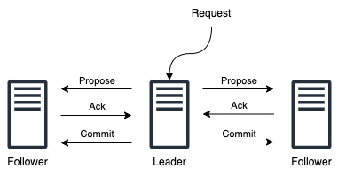

<!--
Copyright 2002-2004 The Apache Software Foundation

Licensed under the Apache License, Version 2.0 (the "License");
you may not use this file except in compliance with the License.
You may obtain a copy of the License at

http://www.apache.org/licenses/LICENSE-2.0

Unless required by applicable law or agreed to in writing, software
distributed under the License is distributed on an "AS IS" BASIS,
WITHOUT WARRANTIES OR CONDITIONS OF ANY KIND, either express or implied.
See the License for the specific language governing permissions and
limitations under the License.
//-->

# ZooKeeper Internals

* [Introduction](#ch_Introduction)
* [Atomic Broadcast](#sc_atomicBroadcast)
    * [Guarantees, Properties, and Definitions](#sc_guaranteesPropertiesDefinitions)
    * [Leader Activation](#sc_leaderElection)
    * [Active Messaging](#sc_activeMessaging)
    * [Summary](#sc_summary)
    * [Comparisons](#sc_comparisons)
* [Consistency Guarantees](#sc_consistency)
* [Quorums](#sc_quorum)
* [Logging](#sc_logging)
    * [Developer Guidelines](#sc_developerGuidelines)
        * [Logging at the Right Level](#sc_rightLevel)
        * [Use of Standard slf4j Idioms](#sc_slf4jIdioms)

## Introduction

This document contains information on the inner workings of ZooKeeper.
It discusses the following topics:

* [Atomic Broadcast](#sc_atomicBroadcast)
* [Consistency Guarantees](#sc_consistency)
* [Quorums](#sc_quorum)
* [Logging](#sc_logging)

## Atomic Broadcast

At the heart of ZooKeeper is an atomic messaging system that keeps all of the servers in sync.

### Guarantees, Properties, and Definitions

The specific guarantees provided by the messaging system used by ZooKeeper are the following:

* *_Reliable delivery_* :
    If a message `m`, is delivered
    by one server, message `m` will be eventually delivered by all servers.

* *_Total order_* :
    If a message `a` is
    delivered before message `b` by one server, message `a` will be delivered before `b` by all
    servers.

* *_Causal order_* :
    If a message `b` is sent after a message `a` has been delivered by the sender of `b`,
    message `a` must be ordered before `b`. If a sender sends `c` after sending `b`, `c` must be ordered after `b`.

The ZooKeeper messaging system also needs to be efficient, reliable, and easy to
implement and maintain. We make heavy use of messaging, so we need the system to
be able to handle thousands of requests per second. Although we can require at
least k+1 correct servers to send new messages, we must be able to recover from
correlated failures such as power outages. When we implemented the system we had
little time and few engineering resources, so we needed a protocol that is
accessible to engineers and is easy to implement. We found that our protocol
satisfied all of these goals.

Our protocol assumes that we can construct point-to-point FIFO channels between
the servers. While similar services usually assume message delivery that can
lose or reorder messages, our assumption of FIFO channels is very practical
given that we use TCP for communication. Specifically we rely on the following property of TCP:

* *_Ordered delivery_* :
    Data is delivered in the same order it is sent and a message `m` is
    delivered only after all messages sent before `m` have been delivered.
    (The corollary to this is that if message `m` is lost all messages after `m` will be lost.)

* *_No message after close_* :
    Once a FIFO channel is closed, no messages will be received from it.

FLP proved that consensus cannot be achieved in asynchronous distributed systems
if failures are possible. To ensure that we achieve consensus in the presence of failures
we use timeouts. However, we rely on time for liveness not for correctness. So,
if timeouts stop working (e.g., skewed clocks) the messaging system may
hang, but it will not violate its guarantees.

When describing the ZooKeeper messaging protocol we will talk of packets,
proposals, and messages:

* *_Packet_* :
    a sequence of bytes sent through a FIFO channel.

* *_Proposal_* :
    a unit of agreement. Proposals are agreed upon by exchanging packets
    with a quorum of ZooKeeper servers. Most proposals contain messages, however the
    NEW_LEADER proposal is an example of a proposal that does not contain to a message.

* *_Message_* :
    a sequence of bytes to be atomically broadcast to all ZooKeeper
    servers. A message put into a proposal and agreed upon before it is delivered.

As stated above, ZooKeeper guarantees a total order of messages, and it also
guarantees a total order of proposals. ZooKeeper exposes the total ordering using
a ZooKeeper transaction id (_zxid_). All proposals will be stamped with a zxid when
it is proposed and exactly reflects the total ordering. Proposals are sent to all
ZooKeeper servers and committed when a quorum of them acknowledge the proposal.
If a proposal contains a message, the message will be delivered when the proposal
is committed. Acknowledgement means the server has recorded the proposal to persistent storage.
Our quorums have the requirement that any pair of quorum must have at least one server
in common. We ensure this by requiring that all quorums have size (_n/2+1_) where
n is the number of servers that make up a ZooKeeper service.

The zxid has two parts: the epoch and a counter. In our implementation the zxid
is a 64-bit number. We use the high order 32-bits for the epoch and the low order
32-bits for the counter. Because zxid consists of two parts, zxid can be represented both as a
number and as a pair of integers, (_epoch, count_). The epoch number represents a
change in leadership. Each time a new leader comes into power it will have its
own epoch number. We have a simple algorithm to assign a unique zxid to a proposal:
the leader simply increments the zxid to obtain a unique zxid for each proposal. _Leadership activation will ensure that only one leader uses a given epoch, so our
simple algorithm guarantees that every proposal will have a unique id._

ZooKeeper messaging consists of two phases:

* *_Leader activation_* :
    In this phase a leader establishes the correct state of the system
    and gets ready to start making proposals.

* *_Active messaging_* :
    In this phase a leader accepts messages to propose and coordinates message delivery.

ZooKeeper is a holistic protocol. We do not focus on individual proposals, rather
look at the stream of proposals as a whole. Our strict ordering allows us to do this
efficiently and greatly simplifies our protocol. Leadership activation embodies
this holistic concept. A leader becomes active only when a quorum of followers
(The leader counts as a follower as well. You can always vote for yourself ) has synced
up with the leader, they have the same state. This state consists of all of the
proposals that the leader believes have been committed and the proposal to follow
the leader, the NEW_LEADER proposal. (Hopefully you are thinking to
yourself, _Does the set of proposals that the leader believes has been committed
include all the proposals that really have been committed?_ The answer is _yes_.
Below, we make clear why.)

### Leader Activation

Leader activation includes leader election (`FastLeaderElection`).
ZooKeeper messaging doesn't care about the exact method of electing a leader as long as the following holds:

* The leader has seen the highest zxid of all the followers.
* A quorum of servers have committed to following the leader.

Of these two requirements only the first, the highest zxid among the followers
needs to hold for correct operation. The second requirement, a quorum of followers,
just needs to hold with high probability. We are going to recheck the second requirement,
so if a failure happens during or after the leader election and quorum is lost,
we will recover by abandoning leader activation and running another election.

After leader election a single server will be designated as a leader and start
waiting for followers to connect. The rest of the servers will try to connect to
the leader. The leader will sync up with the followers by sending any proposals they
are missing, or if a follower is missing too many proposals, it will send a full
snapshot of the state to the follower.

There is a corner case in which a follower that has proposals, `U`, not seen
by a leader arrives. Proposals are seen in order, so the proposals of `U` will have a zxids
higher than zxids seen by the leader. The follower must have arrived after the
leader election, otherwise the follower would have been elected leader given that
it has seen a higher zxid. Since committed proposals must be seen by a quorum of
servers, and a quorum of servers that elected the leader did not see `U`, the proposals
of `U` have not been committed, so they can be discarded. When the follower connects
to the leader, the leader will tell the follower to discard `U`.

A new leader establishes a zxid to start using for new proposals by getting the
epoch, e, of the highest zxid it has seen and setting the next zxid to use to be
(e+1, 0), after the leader syncs with a follower, it will propose a NEW_LEADER
proposal. Once the NEW_LEADER proposal has been committed, the leader will activate
and start receiving and issuing proposals.

It all sounds complicated but here are the basic rules of operation during leader
activation:

* A follower will ACK the NEW_LEADER proposal after it has synced with the leader.
* A follower will only ACK a NEW_LEADER proposal with a given zxid from a single server.
* A new leader will COMMIT the NEW_LEADER proposal when a quorum of followers has ACKed it.
* A follower will commit any state it received from the leader when the NEW_LEADER proposal is COMMIT.
* A new leader will not accept new proposals until the NEW_LEADER proposal has been COMMITTED.

If leader election terminates erroneously, we don't have a problem since the
NEW_LEADER proposal will not be committed since the leader will not have quorum.
When this happens, the leader and any remaining followers will timeout and go back
to leader election.

### Active Messaging

Leader Activation does all the heavy lifting. Once the leader is coronated he can
start blasting out proposals. As long as he remains the leader no other leader can
emerge since no other leader will be able to get a quorum of followers. If a new
leader does emerge,
it means that the leader has lost quorum, and the new leader will clean up any
mess left over during her leadership activation.

ZooKeeper messaging operates similar to a classic two-phase commit.

All communication channels are FIFO, so everything is done in order. Specifically
the following operating constraints are observed:

* The leader sends proposals to all followers using
  the same order. Moreover, this order follows the order in which requests have been
  received. Because we use FIFO channels this means that followers also receive proposals in order.
* Followers process messages in the order they are received. This
  means that messages will be ACKed in order and the leader will receive ACKs from
  followers in order, due to the FIFO channels. It also means that if message `m`
  has been written to non-volatile storage, all messages that were proposed before
  `m` have been written to non-volatile storage.
* The leader will issue a COMMIT to all followers as soon as a
  quorum of followers have ACKed a message. Since messages are ACKed in order,
  COMMITs will be sent by the leader as received by the followers in order.
* COMMITs are processed in order. Followers deliver a proposal
  message when that proposal is committed.

### Summary

So there you go. Why does it work? Specifically, why does a set of proposals
believed by a new leader always contain any proposal that has actually been committed?
First, all proposals have a unique zxid, so unlike other protocols, we never have
to worry about two different values being proposed for the same zxid; followers
(a leader is also a follower) see and record proposals in order; proposals are
committed in order; there is only one active leader at a time since followers only
follow a single leader at a time; a new leader has seen all committed proposals
from the previous epoch since it has seen the highest zxid from a quorum of servers;
any uncommitted proposals from a previous epoch seen by a new leader will be committed
by that leader before it becomes active.

### Comparisons

Isn't this just Multi-Paxos? No, Multi-Paxos requires some way of assuring that
there is only a single coordinator. We do not count on such assurances. Instead
we use the leader activation to recover from leadership change or old leaders
believing they are still active.

Isn't this just Paxos? Your active messaging phase looks just like phase 2 of Paxos?
Actually, to us active messaging looks just like 2 phase commit without the need to
handle aborts. Active messaging is different from both in the sense that it has
cross proposal ordering requirements. If we do not maintain strict FIFO ordering of
all packets, it all falls apart. Also, our leader activation phase is different from
both of them. In particular, our use of epochs allows us to skip blocks of uncommitted
proposals and to not worry about duplicate proposals for a given zxid.

## Consistency Guarantees

The [consistency](https://jepsen.io/consistency) guarantees of ZooKeeper lie between sequential consistency and linearizability. In this section, we explain the exact consistency guarantees that ZooKeeper provides.

Write operations in ZooKeeper are *linearizable*. In other words, each `write` will appear to take effect atomically at some point between when the client issues the request and receives the corresponding response. This means that the writes performed by all the clients in ZooKeeper can be totally ordered in such a way that respects the real-time ordering of these writes. However, merely stating that write operations are linearizable is meaningless unless we also talk about read operations.

Read operations in ZooKeeper are *not linearizable* since they can return potentially stale data. This is because a `read` in ZooKeeper is not a quorum operation and a server will respond immediately to a client that is performing a `read`. ZooKeeper does this because it prioritizes performance over consistency for the read use case. However, reads in ZooKeeper are *sequentially consistent*, because `read` operations will appear to take effect in some sequential order that furthermore respects the order of each client's operations. A common pattern to work around this is to issue a `sync` before issuing a `read`. This too does **not** strictly guarantee up-to-date data because `sync` is [not currently a quorum operation](https://issues.apache.org/jira/browse/ZOOKEEPER-1675). To illustrate, consider a scenario where two servers simultaneously think they are the leader, something that could occur if the TCP connection timeout is smaller than `syncLimit * tickTime`. Note that this is [unlikely](https://www.amazon.com/ZooKeeper-Distributed-Coordination-Flavio-Junqueira/dp/1449361307) to occur in practice, but should be kept in mind nevertheless when discussing strict theoretical guarantees. Under this scenario, it is possible that the `sync` is served by the “leader” with stale data, thereby allowing the following `read` to be stale as well. The stronger guarantee of linearizability is provided if an actual quorum operation (e.g., a `write`) is performed before a `read`.

Overall, the consistency guarantees of ZooKeeper are formally captured by the notion of [ordered sequential consistency](http://webee.technion.ac.il/people/idish/ftp/OSC-IPL17.pdf) or `OSC(U)` to be exact, which lies between sequential consistency and linearizability.

## Quorums

Atomic broadcast and leader election use the notion of quorum to guarantee a consistent
view of the system. By default, ZooKeeper uses majority quorums, which means that every
voting that happens in one of these protocols requires a majority to vote on. One example is
acknowledging a leader proposal: the leader can only commit once it receives an
acknowledgement from a quorum of servers.

If we extract the properties that we really need from our use of majorities, we have that we only
need to guarantee that groups of processes used to validate an operation by voting (e.g., acknowledging
a leader proposal) pairwise intersect in at least one server. Using majorities guarantees such a property.
However, there are other ways of constructing quorums different from majorities. For example, we can assign
weights to the votes of servers, and say that the votes of some servers are more important. To obtain a quorum,
we get enough votes so that the sum of weights of all votes is larger than half of the total sum of all weights.

A different construction that uses weights and is useful in wide-area deployments (co-locations) is a hierarchical
one. With this construction, we split the servers into disjoint groups and assign weights to processes. To form
a quorum, we have to get a hold of enough servers from a majority of groups G, such that for each group g in G,
the sum of votes from g is larger than half of the sum of weights in g. Interestingly, this construction enables
smaller quorums. If we have, for example, 9 servers, we split them into 3 groups, and assign a weight of 1 to each
server, then we are able to form quorums of size 4. Note that two subsets of processes composed each of a majority
of servers from each of a majority of groups necessarily have a non-empty intersection. It is reasonable to expect
that a majority of co-locations will have a majority of servers available with high probability.

With ZooKeeper, we provide a user with the ability of configuring servers to use majority quorums, weights, or a
hierarchy of groups.

## Logging

Zookeeper uses [slf4j](http://www.slf4j.org/index.html) as an abstraction layer for logging. [log4j](http://logging.apache.org/log4j) in version 1.2 is chosen as the final logging implementation for now.
For better embedding support, it is planned in the future to leave the decision of choosing the final logging implementation to the end user.
Therefore, always use the slf4j api to write log statements in the code, but configure log4j for how to log at runtime.
Note that slf4j has no FATAL level, former messages at FATAL level have been moved to ERROR level.
For information on configuring log4j for
ZooKeeper, see the [Logging](zookeeperAdmin.html#sc_logging) section
of the [ZooKeeper Administrator's Guide.](zookeeperAdmin.html)

### Developer Guidelines

Please follow the  [slf4j manual](http://www.slf4j.org/manual.html) when creating log statements within code.
Also read the [FAQ on performance](http://www.slf4j.org/faq.html#logging\_performance), when creating log statements. Patch reviewers will look for the following:

#### Logging at the Right Level

There are several levels of logging in slf4j.

It's important to pick the right one. In order of higher to lower severity:

1. ERROR level designates error events that might still allow the application to continue running.
1. WARN level designates potentially harmful situations.
1. INFO level designates informational messages that highlight the progress of the application at coarse-grained level.
1. DEBUG Level designates fine-grained informational events that are most useful to debug an application.
1. TRACE Level designates finer-grained informational events than the DEBUG.

ZooKeeper is typically run in production such that log messages of INFO level
severity and higher (more severe) are output to the log.

#### Use of Standard slf4j Idioms

_Static Message Logging_

    LOG.debug("process completed successfully!");

However when creating parameterized messages are required, use formatting anchors.

    LOG.debug("got {} messages in {} minutes",new Object[]{count,time});

_Naming_

Loggers should be named after the class in which they are used.

    public class Foo {
        private static final Logger LOG = LoggerFactory.getLogger(Foo.class);
        ....
        public Foo() {
            LOG.info("constructing Foo");

_Exception handling_

    try {
        // code
    } catch (XYZException e) {
        // do this
        LOG.error("Something bad happened", e);
        // don't do this (generally)
        // LOG.error(e);
        // why? because "don't do" case hides the stack trace

        // continue process here as you need... recover or (re)throw
    }
