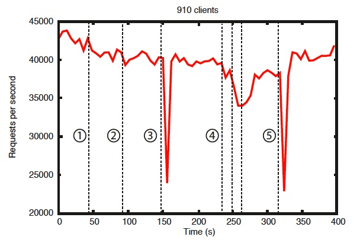

<!--
Copyright 2002-2004 The Apache Software Foundation

Licensed under the Apache License, Version 2.0 (the "License");
you may not use this file except in compliance with the License.
You may obtain a copy of the License at

http://www.apache.org/licenses/LICENSE-2.0

Unless required by applicable law or agreed to in writing, software
distributed under the License is distributed on an "AS IS" BASIS,
WITHOUT WARRANTIES OR CONDITIONS OF ANY KIND, either express or implied.
See the License for the specific language governing permissions and
limitations under the License.
//-->

# ZooKeeper

* [ZooKeeper: A Distributed Coordination Service for Distributed Applications](#ch_DesignOverview)
    * [Design Goals](#sc_designGoals)
    * [Data model and the hierarchical namespace](#sc_dataModelNameSpace)
    * [Nodes and ephemeral nodes](#Nodes+and+ephemeral+nodes)
    * [Conditional updates and watches](#Conditional+updates+and+watches)
    * [Guarantees](#Guarantees)
    * [Simple API](#Simple+API)
    * [Implementation](#Implementation)
    * [Uses](#Uses)
    * [Performance](#Performance)
    * [Reliability](#Reliability)
    * [The ZooKeeper Project](#The+ZooKeeper+Project)

## ZooKeeper: A Distributed Coordination Service for Distributed Applications

ZooKeeper is a distributed, open-source coordination service for
distributed applications. It exposes a simple set of primitives that
distributed applications can build upon to implement higher level services
for synchronization, configuration maintenance, and groups and naming. It
is designed to be easy to program to, and uses a data model styled after
the familiar directory tree structure of file systems. It runs in Java and
has bindings for both Java and C.

Coordination services are notoriously hard to get right. They are
especially prone to errors such as race conditions and deadlock. The
motivation behind ZooKeeper is to relieve distributed applications the
responsibility of implementing coordination services from scratch.

### Design Goals

**ZooKeeper is simple.** ZooKeeper
allows distributed processes to coordinate with each other through a
shared hierarchal namespace which is organized similarly to a standard
file system. The name space consists of data registers - called znodes,
in ZooKeeper parlance - and these are similar to files and directories.
Unlike a typical file system, which is designed for storage, ZooKeeper
data is kept in-memory, which means ZooKeeper can achieve high
throughput and low latency numbers.

The ZooKeeper implementation puts a premium on high performance,
highly available, strictly ordered access. The performance aspects of
ZooKeeper means it can be used in large, distributed systems. The
reliability aspects keep it from being a single point of failure. The
strict ordering means that sophisticated synchronization primitives can
be implemented at the client.

**ZooKeeper is replicated.** Like the
distributed processes it coordinates, ZooKeeper itself is intended to be
replicated over a sets of hosts called an ensemble.

The servers that make up the ZooKeeper service must all know about
each other. They maintain an in-memory image of state, along with a
transaction logs and snapshots in a persistent store. As long as a
majority of the servers are available, the ZooKeeper service will be
available.

Clients connect to a single ZooKeeper server. The client maintains
a TCP connection through which it sends requests, gets responses, gets
watch events, and sends heart beats. If the TCP connection to the server
breaks, the client will connect to a different server.

**ZooKeeper is ordered.** ZooKeeper
stamps each update with a number that reflects the order of all
ZooKeeper transactions. Subsequent operations can use the order to
implement higher-level abstractions, such as synchronization
primitives.

**ZooKeeper is fast.** It is
especially fast in "read-dominant" workloads. ZooKeeper applications run
on thousands of machines, and it performs best where reads are more
common than writes, at ratios of around 10:1.

### Data model and the hierarchical namespace

The name space provided by ZooKeeper is much like that of a
standard file system. A name is a sequence of path elements separated by
a slash (/). Every node in ZooKeeper's name space is identified by a
path.

#### ZooKeeper's Hierarchical Namespace

### Nodes and ephemeral nodes

Unlike standard file systems, each node in a ZooKeeper
namespace can have data associated with it as well as children. It is
like having a file-system that allows a file to also be a directory.
(ZooKeeper was designed to store coordination data: status information,
configuration, location information, etc., so the data stored at each
node is usually small, in the byte to kilobyte range.) We use the term
_znode_ to make it clear that we are talking about
ZooKeeper data nodes.

Znodes maintain a stat structure that includes version numbers for
data changes, ACL changes, and timestamps, to allow cache validations
and coordinated updates. Each time a znode's data changes, the version
number increases. For instance, whenever a client retrieves data it also
receives the version of the data.

The data stored at each znode in a namespace is read and written
atomically. Reads get all the data bytes associated with a znode and a
write replaces all the data. Each node has an Access Control List (ACL)
that restricts who can do what.

ZooKeeper also has the notion of ephemeral nodes. These znodes
exists as long as the session that created the znode is active. When the
session ends the znode is deleted. Ephemeral nodes are useful when you
want to implement _[tbd]_.

### Conditional updates and watches

ZooKeeper supports the concept of _watches_.
Clients can set a watch on a znode. A watch will be triggered and
removed when the znode changes. When a watch is triggered, the client
receives a packet saying that the znode has changed. If the
connection between the client and one of the Zoo Keeper servers is
broken, the client will receive a local notification. These can be used
to _[tbd]_.

### Guarantees

ZooKeeper is very fast and very simple. Since its goal, though, is
to be a basis for the construction of more complicated services, such as
synchronization, it provides a set of guarantees. These are:

* Sequential Consistency - Updates from a client will be applied
  in the order that they were sent.
* Atomicity - Updates either succeed or fail. No partial
  results.
* Single System Image - A client will see the same view of the
  service regardless of the server that it connects to.

* Reliability - Once an update has been applied, it will persist
  from that time forward until a client overwrites the update.

* Timeliness - The clients view of the system is guaranteed to
  be up-to-date within a certain time bound.

For more information on these, and how they can be used, see
_[tbd]_

### Simple API

One of the design goals of ZooKeeper is provide a very simple
programming interface. As a result, it supports only these
operations:

* *create* :
    creates a node at a location in the tree

* *delete* :
    deletes a node

* *exists* :
    tests if a node exists at a location

* *get data* :
    reads the data from a node

* *set data* :
    writes data to a node

* *get children* :
    retrieves a list of children of a node

* *sync* :
    waits for data to be propagated

For a more in-depth discussion on these, and how they can be used
to implement higher level operations, please refer to
_[tbd]_

### Implementation

[ZooKeeper Components](#zkComponents) shows the high-level components
of the ZooKeeper service. With the exception of the request processor,
each of
the servers that make up the ZooKeeper service replicates its own copy
of each of the components.

The replicated database is an in-memory database containing the
entire data tree. Updates are logged to disk for recoverability, and
writes are serialized to disk before they are applied to the in-memory
database.

Every ZooKeeper server services clients. Clients connect to
exactly one server to submit irequests. Read requests are serviced from
the local replica of each server database. Requests that change the
state of the service, write requests, are processed by an agreement
protocol.

As part of the agreement protocol all write requests from clients
are forwarded to a single server, called the
_leader_. The rest of the ZooKeeper servers, called
_followers_, receive message proposals from the
leader and agree upon message delivery. The messaging layer takes care
of replacing leaders on failures and syncing followers with
leaders.

ZooKeeper uses a custom atomic messaging protocol. Since the
messaging layer is atomic, ZooKeeper can guarantee that the local
replicas never diverge. When the leader receives a write request, it
calculates what the state of the system is when the write is to be
applied and transforms this into a transaction that captures this new
state.

### Uses

The programming interface to ZooKeeper is deliberately simple.
With it, however, you can implement higher order operations, such as
synchronizations primitives, group membership, ownership, etc. Some
distributed applications have used it to: _[tbd: add uses from
white paper and video presentation.]_ For more information, see
_[tbd]_

### Performance

ZooKeeper is designed to be highly performant. But is it? The
results of the ZooKeeper's development team at Yahoo! Research indicate
that it is. (See [ZooKeeper Throughput as the Read-Write Ratio Varies](#zkPerfRW).) It is especially high
performance in applications where reads outnumber writes, since writes
involve synchronizing the state of all servers. (Reads outnumbering
writes is typically the case for a coordination service.)

The [ZooKeeper Throughput as the Read-Write Ratio Varies](#zkPerfRW) is a throughput
graph of ZooKeeper release 3.2 running on servers with dual 2Ghz
Xeon and two SATA 15K RPM drives.  One drive was used as a
dedicated ZooKeeper log device. The snapshots were written to
the OS drive. Write requests were 1K writes and the reads were
1K reads.  "Servers" indicate the size of the ZooKeeper
ensemble, the number of servers that make up the
service. Approximately 30 other servers were used to simulate
the clients. The ZooKeeper ensemble was configured such that
leaders do not allow connections from clients.

###### Note
>In version 3.2 r/w performance improved by ~2x compared to
 the [previous 3.1 release](http://zookeeper.apache.org/docs/r3.1.1/zookeeperOver.html#Performance).

Benchmarks also indicate that it is reliable, too.
[Reliability in the Presence of Errors](#zkPerfReliability) shows how a deployment responds to
various failures. The events marked in the figure are the following:

1. Failure and recovery of a follower
1. Failure and recovery of a different follower
1. Failure of the leader
1. Failure and recovery of two followers
1. Failure of another leader

### Reliability

To show the behavior of the system over time as
failures are injected we ran a ZooKeeper service made up of
7 machines. We ran the same saturation benchmark as before,
but this time we kept the write percentage at a constant
30%, which is a conservative ratio of our expected
workloads.

The are a few important observations from this graph. First, if
followers fail and recover quickly, then ZooKeeper is able to sustain a
high throughput despite the failure. But maybe more importantly, the
leader election algorithm allows for the system to recover fast enough
to prevent throughput from dropping substantially. In our observations,
ZooKeeper takes less than 200ms to elect a new leader. Third, as
followers recover, ZooKeeper is able to raise throughput again once they
start processing requests.

### The ZooKeeper Project

ZooKeeper has been
[successfully used](https://cwiki.apache.org/confluence/display/ZOOKEEPER/PoweredBy)
in many industrial applications.  It is used at Yahoo! as the
coordination and failure recovery service for Yahoo! Message
Broker, which is a highly scalable publish-subscribe system
managing thousands of topics for replication and data
delivery.  It is used by the Fetching Service for Yahoo!
crawler, where it also manages failure recovery. A number of
Yahoo! advertising systems also use ZooKeeper to implement
reliable services.

All users and developers are encouraged to join the
community and contribute their expertise. See the
[Zookeeper Project on Apache](http://zookeeper.apache.org/)
for more information.

