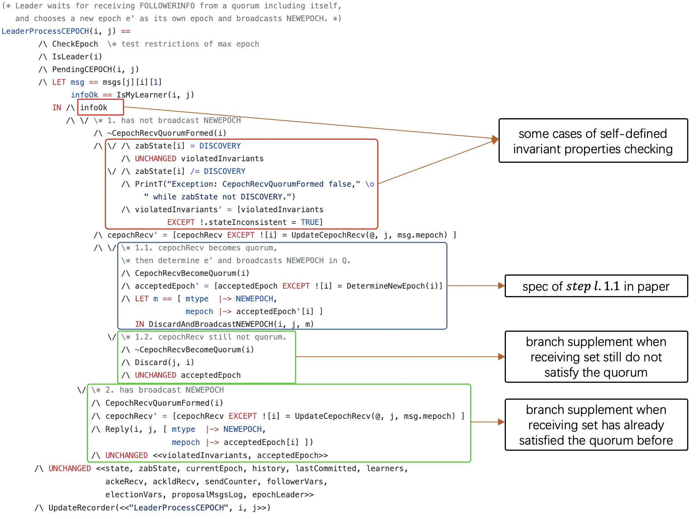

<!--
Licensed to the Apache Software Foundation (ASF) under one
or more contributor license agreements.  See the NOTICE file
distributed with this work for additional information
regarding copyright ownership.  The ASF licenses this file
to you under the Apache License, Version 2.0 (the
"License"); you may not use this file except in compliance
with the License.  You may obtain a copy of the License at

    http://www.apache.org/licenses/LICENSE-2.0

Unless required by applicable law or agreed to in writing, software
distributed under the License is distributed on an "AS IS" BASIS,
WITHOUT WARRANTIES OR CONDITIONS OF ANY KIND, either express or implied.
See the License for the specific language governing permissions and
limitations under the License.
//-->

# ZooKeeper's Protocol Specification of TLA+

## Overview
ZooKeeper's Protocol Specification focuses on the Zookeeper Atomic Broadcast (Zab) consensus protocol proposed in *Junqueira F P, Reed B C, Serafini M. Zab: High-performance broadcast for primary-backup systems[C]//2011 IEEE/IFIP 41st International Conference on Dependable Systems & Networks (DSN). IEEE, 2011: 245-256*.  

We have completed the the [protocol specification](Zab.tla) for Zab using TLA+ toolbox, and we have done a certain scale of model checking to verify the correctness of Zab. From the experience, we have found some subtle [issues](issues.md) related to the protocol specification and the Zab informal description. 

To handle the ambiguities and omissions of the informal description in the paper, we supplement the specification with some further details. If you have any question, please let us know.

## Specification Development

### Requirements
TLA+ toolbox version 1.7.0

### Run
Create specification [Zab.tla](Zab.tla) and run models in the following way.  
We can clearly divide spec into five modules, which are:  

- Phase0. Leader Election  
- Phase1. Discovery  
- Phase2. Synchronization  
- Phase3. Broadcast  
- Abnormal situations like failure, network disconnection

#### Assign constants
After creating this new model and choosing *Temporal formula* with value *Spec*, we first assign most of constants.  
We should set CONSTANTS about server states as model value, including *FOLLOWING*, *LEADING*, and *LOOKING*.  
We should set CONSTANTS about server zabStates as model value, including *ELECTION*, *DISCOVERY*, *SYNCHRONIZATION*, and *BROADCAST*.  
We should set CONSTANTS about message types as model value, including *CEPOCH*, *NEWEPOCH*, *ACKE*, *NEWLEADER*, *ACKLD*, *COMMITLD*, *PROPOSE*, *ACK*, and *COMMIT*.  

#### Assign left constants affecting state space
Then we should assign CONSTANTS *Server* as a symmetrical model value(such as <symmetrical\>{s1, s2, s3}).  
To compress state space, we need to assign CONSTANT *Parameters* as a record, whose domain contains *MaxTimeoutFailures*, *MaxTransactionNum*, *MaxEpoch*, and *MaxRestarts*. For example, we can assign it to format like [MaxTimeoutFailures |-> 3, MaxTransactionNum |-> 5, MaxEpoch |-> 3, MaxRestarts |-> 2].

#### Assign invariants
We remove *'Deadlock'* option.  
We add invariants defined in spec into *'Invariants'* to check whether the model will reach an illogical state, including *ShouldNotBeTriggered*, *Leadership1*, *Leadership2*, *PrefixConsistency*, *Integrity*, *Agreement*, *TotalOrder*, *LocalPrimaryOrder*, *GlobalPriamryOrder*, and *PrimaryIntegrity*.  
Here the meanings of these invariants are described in the following. Except for the first four, all invariants are defined in paper.   
	-	**ShouldNotBeTriggered**: Some conditions should not be triggered when we are running the model. For example, follower should not receive NEWLEADER when its zabState is not SYNCHRONIZATION.  
	-	**Lerdership**: There is most one established leader in a certain epoch.(Established means leader has updated its f.a and switched its zabState to SYNCHRONIZATION.)  
	-	**PrefixConsistency**: Transactions that have been committed in history are the same in any server.  
	-	**Integrity**: If some follower delivers one transaction, some primary must have broadcast it.  
	-	**Agreement**: If some follower *f1* delivers transaction *a* and some follower *f2* delivers transaction *b*, then *f2* delivers *a* or *f1* delivers *b*.  
	-	**TotalOrder**: If some server delivers *a* before *b*, then any server that delivers *b* must also deliver *a* and deliver *a* before *b*.  
	-	**LocalPrimaryOrder**: If a primary broadcasts *a* before it broadcasts *b*, then a follower that delivers *b* must also deliver *a* before *b*.  
	-	**GlobalPrimaryOrder**: A server *f* delivers both *a* with epoch *e* and *b* with epoch *e'*, and *e* < *e'*, then *f* must deliver *a* before *b*.  
	-	**PrimaryIntegrity**: If primary *p* broadcasts *a* and some follower *f* delivers *b* such that *b* has epoch smaller than epoch of *p*, then *p* must deliver *b* before it broadcasts *a*.  

#### Assign additional TLC options
We set number of worker threads as 10(if unavailable on your system, just decrease it).  
We can choose checking mode from *Model-checking mode* and *simulation mode*.  

-	Model-checking mode: It is a traverse method like BFS. Diameter in results represent the maximum depth when traversing. All intermediate results will be saved as binary files locally and occupy a large space if running time is long.  
-	Simulation mode: Everytime TLC randomly chooses a path and run through it until reaching termination or reaching maximum length of the trace, and randomly chooses another path. Currently we set *Maximum length of the trace* as 100.  
Here we mainly use simulation mode to discover if there exists deep bugs, which is hard to be found in model-checking mode.

### Results

You can find our [result](verification-statistics.md) of verification using TLC model checking.

## Adjustments in protocol spec from paper
>Because the pursuit of the paper is to describe the Zab protocol to others in a concise manner, which will lead to insufficient description of the protocol, there are missing or vague places in the paper. As a mathematical language, no ambiguity is allowed in the TLA+ specification, and this is why we need adjustment.

Overall, we categorize the flaws of the original paper into two classes: abstraction and vagueness.

### Abstraction

There is a missing part in the paper, in which the pseudocode uses the **Discovery** stage as the initial stage of each round, and omits the **Election** stage.  

On the one hand, in spec, **Election** helps advance the state of the system, and is also related to the liveness and strong consistency of the system, so we cannot omit it. On the other hand, our focus is on Zab, so the **Election** module should be expressed with a small number of variables and actions to reduce the state space of the model.

We use one variable *leaderOracle* and two actions *UpdateLeader* and *FollowerLeader* to express the **election** module streamlined.

### Vagueness

We categorize vagueness in the paper into two classes: vagueness in variables and vagueness in actions.

#### Vagueness in variables
First, the character **Q** is used everywhere in the pseudocode to represent the set of Followers perceived by the Leader in the current term. We divide the set **Q** specifically into variables *learners*, *cepochRecv*, *ackeRecv* and *ackldRecv*. We use *cepochRecv* to let Leader broadcast *NEWEPOCH*, *ackeRecv* to let Leader broadcast *NEWLEADER* and *PROPOSE*, *ackldRecv* to let Leader broadcast *COMMIT-LD* and *COMMIT*. We will explain the reason why we use these sets when Leader broadcasts *PROPOSE* and *COMMIT* in the [issues](issues.md).

Second, *zxid* in *COMMIT-LD* is omitted in hte paper. We will explain the value of the *zxid* in the [issues](issues.md).

#### Vagueness in actions
Totally, adjustment on vagueness in actions can be divided into two classes: Completing the missing description and Adjusting the protocol structure.

*	For completing the missing description, we categorize four classes:

	1.	Complete the branch of action where after the Leader node processes the message *m* of type *t*, the receiving set of messages of type *t* still does not satisfy the quorum.
	2.	Complete the branch of action where before the Leader node processes the message *m* of type *t*, the receiving set of messages of type *t* has already satisfied the quorum.
	3.	Supplement the logical action that the Leader receives the request from the client, encapsulates the request as a log entry, and persists the log entry.
	4.	Supplement the logical action that the Leader tries to commit log entries based on confirmation information from followers.

*	For adjusting the protocol structure, in order to improve the readability of the spec, we impose standardized and unified restrictions on the spec. That is, the division unit is to one node receiving and processing one message. Each action, except actions in election module and environment error module, makes a node receiving a certain message a trigger condition, and then produces a subsequent state change.

See example when Leader processes message *CEPOCH* from one follower:

