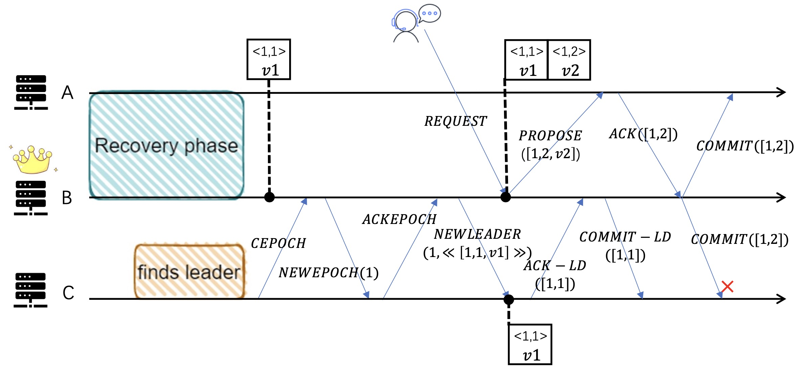
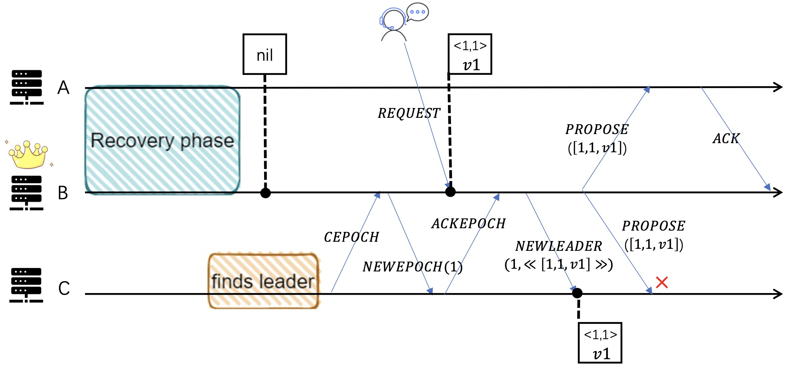
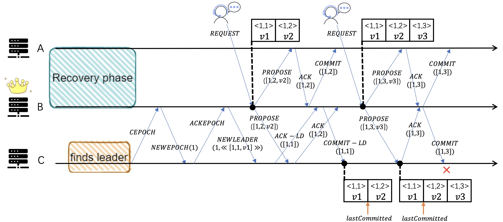

<!--
Licensed to the Apache Software Foundation (ASF) under one
or more contributor license agreements.  See the NOTICE file
distributed with this work for additional information
regarding copyright ownership.  The ASF licenses this file
to you under the Apache License, Version 2.0 (the
"License"); you may not use this file except in compliance
with the License.  You may obtain a copy of the License at

    http://www.apache.org/licenses/LICENSE-2.0

Unless required by applicable law or agreed to in writing, software
distributed under the License is distributed on an "AS IS" BASIS,
WITHOUT WARRANTIES OR CONDITIONS OF ANY KIND, either express or implied.
See the License for the specific language governing permissions and
limitations under the License.
//-->

# Issues

>This document describes issues related to the ambiguous description of the Zab protocol. 

## （Issue 1）Issue introduced by vague explanation of broadcast object set Q
Because the Leader will only accept the client request when it reaches the *Broadcast* stage, thus when Leader broadcasting messages from *Broadcast* stage, we naturally use the set *ackldRecv* as the object set when Leader broadcasting *Propose* and *Commit* messages in the initial protocol. 

On this basis, the model checking found that there was an error in the protocol. After analyzing the execution path and the violated invariant, we located the error in the action *FollowerProcessCommit*. The Follower received an illegal *COMMIT* message, as shown in the figure below. In the *COMMIT* message, the log entry corresponding to the *zxid* does not exist in the local log.  

A quorum of nodes including node *A* and node *B* completed the log recovery, and entered the *Broadcast* stage. Leader node *B* sent *NEWLEADER*(1, <[1, 1, v1]>) to node *C*, which joined the cluster. Then Leader *B* received client request and broadcast *PROPOSE*([1, 2, v2]). But node *C* did not receive the message because *C* is not in *B*'s *ackldRecv*. Later, the Leader firstly processes *ACK-LD* from *C* and then *ACK* from *A*. So, the object of Leader *B*'s broadcast *COMMIT*([1, 2]) contains *C*, and there is no log entry with *zxid* [1, 2] locally in *C*.

We found that because the set of objects when the Leader broadcast *PROPOSE* is *ackldRecv*, the Follower will not receive messages with type *PROPOSE* until receiving the *COMMIT-LD*. If a log entry is committed between the Leader sending *NEWLEADER* and *COMMIT-LD*, the corresponding receiver will permanently lose the log entry.

Therefore, we have made amendments in the spec. When the Leader broadcasts *PROPOSE*, the set of sending objects has been changed from *ackldRecv* to *ackeRecv*. We successfully discovered errors introduced by the vague description of **Q** in the protocol through model checking, and fixed them in the specification.

## (Issue 2) Issue introduced by lack of client request logic
Since there is not discriptions about client request, we need to add a process that describes the Leader receives a client request and encapsulates the request as a new log entry and appends it to the local log. This process are represented as action *LeaderProcessRequest* in the spec.

In our original specification, when Follower receives the message *PROPOSE*, the *zxid* of the proposed log entry should be the successor *zxid* of the latest local log entry‘s *zxid*, otherwise it will be regarded as an illegal *PROPOSE*.

On this basis, model checking told us that there was an error in the model, as shown in the figure below, where Follower receives redundant *PROPOSE* from the same log entry. 

A quorum of nodes including node *A* and *B* completed log recovery first and entered the *Broadcast* stage. When receiving a client request, Leader B encapsulated the request as a log entry [1, 1, v1]. Before B broadcast the proposal of the log entry, node *C* that joined the cluster later sent *ACKEPOCH* to *B*, and *B* replied with *NEWLEADER*(1, <[1, 1, v1]>), and added *C* to the set *ackeRecv*. So the *PROPOSE*([1, 1, v1]) broadcast by *B* was also sent to *C*, so *C* received the redundant proposal for the log entry [1, 1, v1].

We have analyzed two repair schemes. The first scheme is to atomize the actions *LeaderProcessRequest* and *LeaderBroadcastPROPOSE* and merge them into one action. The second scheme is to relax the constraints, where if the Follower receives redundant *PROPOSE*, it will be release this message directly. We chose the second scheme, because we think the situation is not serious and will not affect the correctness of Zab.

## (Issue 3) Issue introduced by ambiguity of zxid in the message COMMIT-LD
When the Leader sends *COMMIT-LD*, the paper does not express the specific value of the *zxid* carried in the message. Therefore, we naturally set the *zxid* carried in *COMMIT-LD* to the *zxid* in *ACK-LD*.

Therefore, the model checking found an invariant violation, as shown in the figure below, the Follower received an illegal message *COMMIT*.

A quorum of nodes including node *A* and *B* completed log recovery first and entered the *Broadcast* stage. When the node *C* that joined the cluster later sent *ACKEPOCH* to Leader *B*, *B* sent *NEWLEADER*(1, <[1, 1, v1]>) to *C*, and then received the client request to broadcast *PROPOSE*([1, 2, v2]). Then, *B* received the message *ACK*([1, 2]) from *A* before receiving *ACK-LD* from *C*, so Leader *B* committed the log entry [1, 2, v2] and broadcasts *COMMIT*([1, 2]). Because the object set when broadcasting *COMMIT* is *ackldRecv*, *C* did not receive the commit message. Afterwards, *B* processed the *ACK-LD*([1, 1]) from *C*, and replied with *COMMIT-LD*([1, 1]). Therefore, when Leader *B* reached a consensus on the new log entry [1, 3, v3], it sendt *COMMIT*([1, 3]) to *C*, and *C* found that entry [1, 2, v2] in the local log has not been committed yet, which was treated as an illegal *COMMIT*.

The repair solution we analyzed is that in the action *LeaderProcessACKLD*, the *zxid* carried by *COMMIT-LD* is changed from the *zxid* in *ACK-LD* to the latest *zxid* committed locally by Leader, thus making up for the missing commit information.
