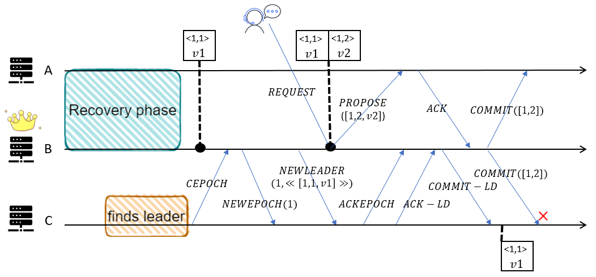
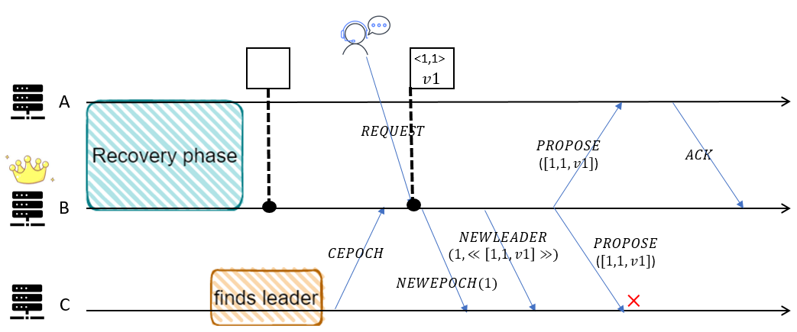

# Zab-tla

## Overview
This project is devoted to providing formal specification and verification using TLA+ for the Zookeeper Atomic Broadcast(Zab) consensus protocol proposed in *Junqueira F P, Reed B C, Serafini M. Zab: High-performance broadcast for primary-backup systems[C]//2011 IEEE/IFIP 41st International Conference on Dependable Systems & Networks (DSN). IEEE, 2011: 245-256*.  

We have made a formal [specification](Zab.tla) for Zab using TLA+ toolbox, and we have done a certain scale of model checking to verify the correctness of Zab.

Currently we have completed writing [spec](https://github.com/BinyuHuang-nju/zookeeper/tree/master/zookeeper-specifications) for ZAB 1.0 that used in ZooKeeper production.

Due to the simplification of Zab algorithm description in the paper, some details in specification were modified and added. If you have any question, please let us know.

## Requirements
TLA+ toolbox version 1.7.0

## Run
Create specification [Zab.tla](Zab.tla) and run models in the following way.  
We can clearly divide spec into five modules, which are:  
- Phase0. Leader Election  
- Phase1. Discovery  
- Phase2. Synchronization  
- Phase3. Broadcast  
- Abnormal situations like failure, network disconnection
 
### Assign constants
After creating this new model and choosing *Temporal formula* with value *Spec*, we first assign most of constants.  
We should set CONSTANTS about server states as model value, including *FOLLOWING*, *LEADING*, and *LOOKING*.  
We should set CONSTANTS about server zabStates as model value, including *ELECTION*, *DISCOVERY*, *SYNCHRONIZATION*, and *BROADCAST*.  
We should set CONSTANTS about message types as model value, including *CEPOCH*, *NEWEPOCH*, *ACKE*, *NEWLEADER*, *ACKLD*, *COMMITLD*, *PROPOSE*, *ACK*, and *COMMIT*.  

### Assign left constants affecting state space
Then we should assign CONSTANTS *Server* as a symmetrical model value(such as <symmetrical\>{s1, s2, s3}).  
To compress state space, we need to assign CONSTANT *Parameters* as a record, whose domain contains *MaxTimeoutFailures*, *MaxTransactionNum*, *MaxEpoch*, and *MaxRestarts*. For example, we can assign it to format like [MaxTimeoutFailures |-> 3, MaxTransactionNum |-> 5, MaxEpoch |-> 3, MaxRestarts |-> 2].

### Assign invariants
We remove *'Deadlock'* option.  
We add invariants defined in spec into *'Invariants'* to check whether the model will reach an illogical state, including *ShouldNotBeTriggered*, *Leadership1*, *Leadership2*, *PrefixConsistency*, *Integrity*, *Agreement*, *TotalOrder*, *LocalPrimaryOrder*, *GlobalPriamryOrder*, and *PrimaryIntegrity*.  
Here the meanings of these invariants are described in the following. Except for the first four, all invariants are defined in paper.   
	-	**ShouldNotBeTriggered**: Some conditions should not be triggered when we are running the model. For example, follower should not receive NEWLEADER when its zabState is not SYNCHRONIZATION.  
	-	**Lerdership**: There is most one established leader in a certain epoch.(Established means leader has updated its f.a and switched its zabState to SYNCHRONIZATION.)  
	-	**PrefixConsistency**: Transactions that have been committed in history are the same in any server.  
	-	**Integrity**: If some follower delivers one transaction, some primary must have broadcast it.  
	-	**Agreement**: If some follower *f1* delivers transaction *a* and some follower *f2* delivers transaction *b*, then *f2* delivers *a* or *f1* delivers *b*.  
	-	**TotalOrder**: If some server delivers *a* before *b*, then any server that delivers *b* must also deliver *a* and deliver *a* before *b*.  
	-	**LocalPrimaryOrder**: If a primary broadcasts *a* before it broadcasts *b*, then a follower that delivers *b* must also deliver *a* before *b*.  
	-	**GlobalPrimaryOrder**: A server *f* delivers both *a* with epoch *e* and *b* with epoch *e'*, and *e* < *e'*, then *f* must deliver *a* before *b*.  
	-	**PrimaryIntegrity**: If primary *p* broadcasts *a* and some follower *f* delivers *b* such that *b* has epoch smaller than epoch of *p*, then *p* must deliver *b* before it broadcasts *a*.  

### Assign additional TLC options
We set number of worker threads as 10(if unavailable on your system, just decrease it).  
We can choose checking mode from *Model-checking mode* and *simulation mode*.  
	-	Model-checking mode: It is a traverse method like BFS. Diameter in results represent the maximum depth when traversing. All intermediate results will be saved as binary files locally and occupy a large space if running time is long.  
	-	Simulation mode: Everytime TLC randomly chooses a path and run through it until reaching termination or reaching maximum length of the trace, and randomly chooses another path. Currently we set *Maximum length of the trace* as 100.  
Here we mainly use simulation mode to discover if there exists deep bug, which is hard to be found in model-checking mode.

### Results
You can find our [result](experiment/README.md) of verification using TLC model checking.

## Abstraction in specification
>The Zab protocol in paper dose not focus on leader election, so we abstract the process of leader election in spec. Our spec can simulate non-Byzantion faults. In addition, what we pay attention to is consistency of system state, and we abstract or omit some parts in actual implementation, such as replying results to client, heartbeat transmission, and so on. These modules all do not affect consistency of Zab.

### Abstraction to Election
Since paper pay no attention to leader election, while as to let model run, election module can not be omitted. To simplify election, we have a global variable *leaderOracle*, that all servers can visit. And there are two actions let server complete election, *UpdateLeader* and *FollowLeader*. *UpdateLeader* is used to update leaderOracle. *FolLowLeader* is used to help one server find leader and follow it.  

### Abstraction to communication medium
Communication in Zab is based on TCP channels, so there is no packet loss, redundancy, or disorder in message delivery. We use module *Sequence* in TLA+ to simulate channel meeting the property of receiving messages in order. So there is a certain difference between our communication channel and end-to-end TCP channel.    
We believe it can simulate message delay when a server does not perform the action of receiving messages. And it can simulate a process failure when a server does not perform any action.

### Abstraction and omission to actions unrelated to system state
What we care about is consistecy of the state in the system. We do not care about details like client request or the system's reply to client, or server applying transactions to replica. Therefore, we simplify the process of client requesting, and omit reply to client. We assume that each committed transaction will be delivered to replica immediately, so we can treat variable history[i][1..commitIndex] as the transaction sequence that server *i* delivers to the corresponding replica.

## Differences between spec and paper
>This section describes difference between the protocol in paper and our specification. We incorporate our own ideas into spec.

### (Issue 1) Line: 395, Action: UpdateLeader, FollowLeader
Since paper pay no attention to leader election, we use global variable *leaderOracle* to simplify election module. In action *UpdateLeader*, we let a server in *LOOKING* be the new leader, and update *leaderOracle*. In action *FollowLeader*, we let a server in *LOOKING* switches its state to *FOLLOWING* or *LEADING* according to *leaderOracle*. 

### (Issue 2) Line: 513, Action: LeaderProcessCEPOCH, LeaderProcessACKEPOCH, LeaderProcessACKLD
In the pseudocode of the paper, it always mentions broadcasting a certain message to *Q* like *NEWEPOCH*, *NEWLEADER*, or *PROPOSE*. But it is very vague that *Q* represents which servers at each stage, and this is not stated in paper. Defining *learners* as the set of servers that establish connection with a certain leader, *cepochRecv* as the set of servers this leader has received *CEPOCH* from, *ackeRecv* as the set of servers this leader has received *ACKEPOCH* from, *ackldRecv* as the set of servers this leader has received *ACKLD* from, we konw that *ackldRecv* ⊆  *ackeRecv* ⊆ *cepochRecv* ⊆ *learners*. It is obviously wrong when we let leader broadcast *COMMITLD* to servers in *cepochRecv*, because there may exist some follower not receiving *NEWLEADER* in *cepochRecv*. So it is very important to define each '*Q*' in paper clearly.  
Here we let *cepochRecv* as *Q* in *step l.1.1* to broadcast *NEWECPOCH*, *ackeRecv* as *Q* in *step l.2.1* to broadcast *NEWLEADER*, *ackldRecv* as *Q* in *step l.2.2* to broadcast *COMMITLD*.

### (Issue 3) Line: 907, Action: LeaderBroadcastPROPOSE, LeaderProcessACK
Except for *NEWEPOCH*, *NEWLEADER* and *COMMITLD*, leader has to broadcst *PROPOSE* and *COMMIT* in *BROADCAST* stage. According to *step l.3.3* and *step l.3.4* in the pseudocode of the paper, we initially assumed leader broadcasts *PROPOSE* or *COMMIT* to servers in *ackldRecv*. Then it would produce a bug in which follower receives commit of a txn which not exists in history.    
    
It is because follower will not receive *PROPOSE* until reiceiving *COMMITLD*, according to *step l.3.4* in paper.  
What we do in spec is when leader broadcasts *PROPOSE*, *Q* is *ackeRecv*, and when leader broadcasts *COMMIT*, *Q* is *ackldRecv*. So any follower that receives *PROPOSE* must have received *NEWLEADER* before, and any follower that receives *COMMIT* must have received *COMMITLD* before.   
So we should not directly reply *NEWEPOCH* and *NEWLEADER* when leader receives *CEPOCH* in *BROADCAST*， described in *step l.3.3*. As the same in the previous stages, leader will not reply *NEWLEADER* until receiving *ACKEPOCH*.  
So here, *COMMITLD* is a commit of txns in *NEWLEADER* and perhaps several *PROPOSE*. Because follower may reply *ACKLD* late, and it may reiceive several messages of *PROPOSE* but no *COMMIT* of corresponding *PROPOSE*. And we successfully find a bug of pseudocode of the paper.

### (Issue 4) Line: 939, Action: FollowerProcessPROPOSE
If action when leader processes *REQUEST* and action when leader broadcasts *PROPOSE* is not atomically performed, there exists another bug in which follower reiceives proposals of one same txn.  
  
We can see that follower C reveives txn with zxid <1,1> twice, which makes conflict.  
What we do is spec is when follower receives *PROPOSE*, if the zxid is the next zxid of lastZxid in history, follower accepts this txn. Else, follower ignores this txn, because this txn must exist in history.  
Here we can find that when follower receives *PROPOSE*, either the txn exist in history, or the zxid of txn is the next zxid in history.   
